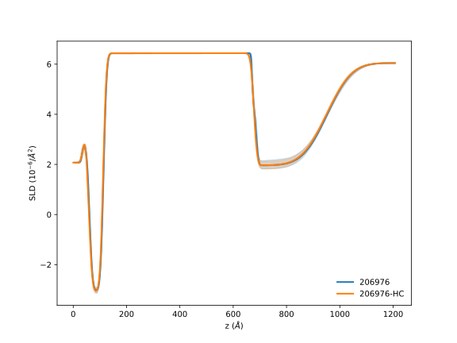
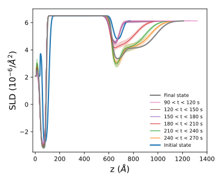
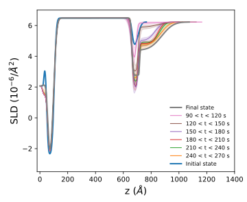
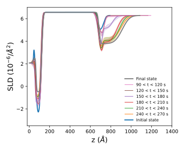
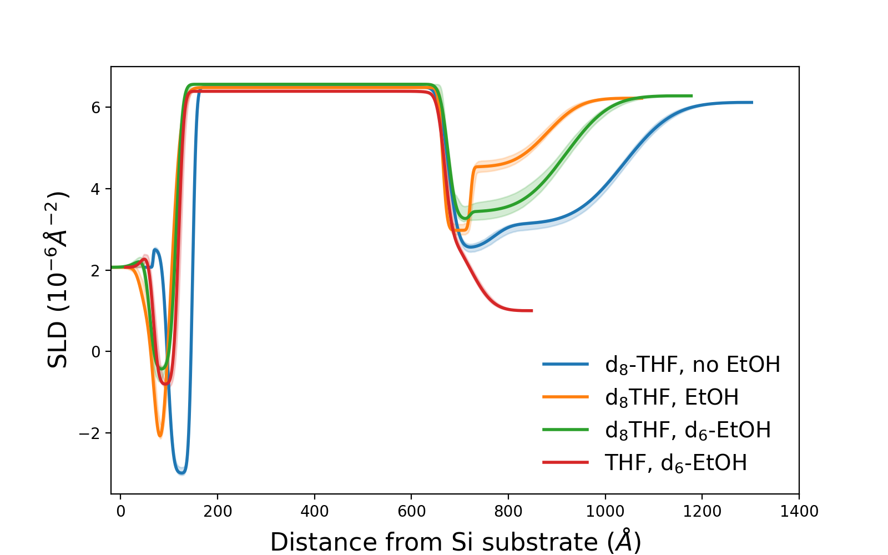
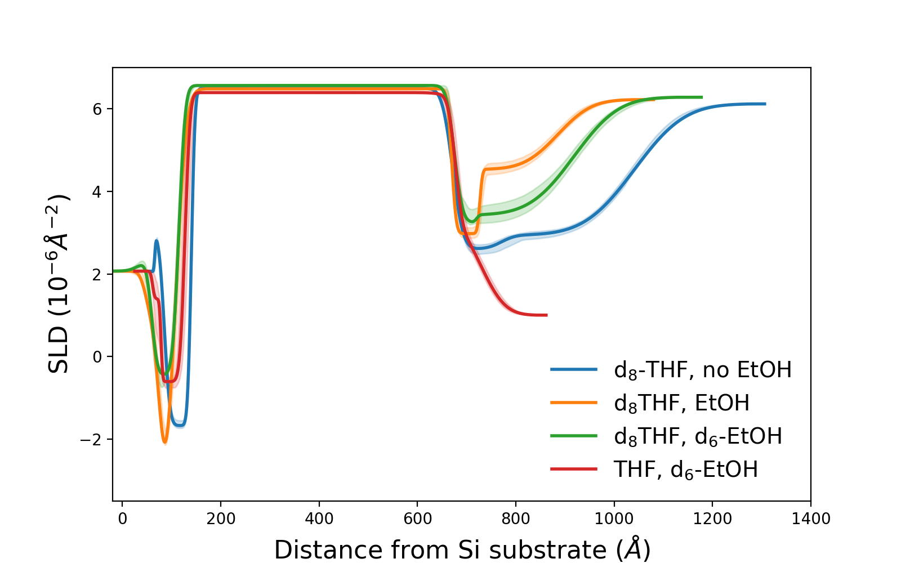
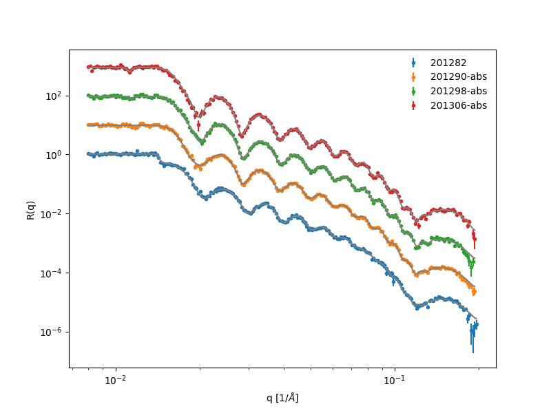
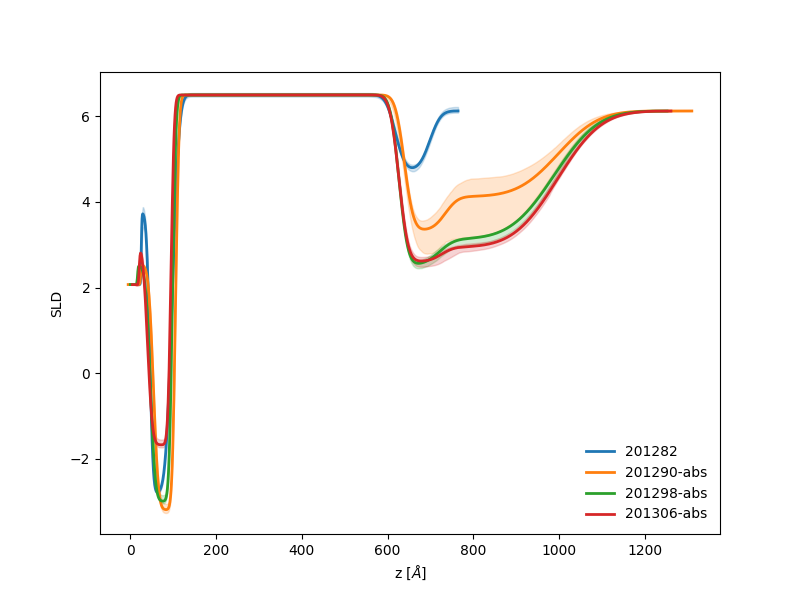
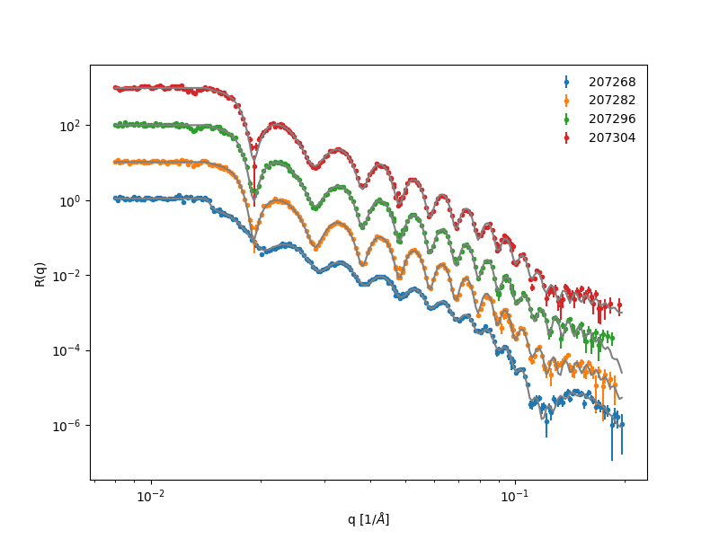
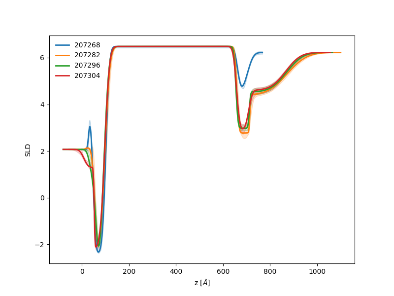

# Analysis summary [2023 experiments]

QUESTION: in which figure do we use January Cu-F?

ANSWER: We don't!! It was just a repeat

## Figure 1: Structure as a function of current density
July Cu-A. Fit output files can be found in `july2023/data/results/refl1d_output`.

| Current | Run |
| --- | --- |
| OCV 1 | 206907 |
| -0.5 | 206915 |
| -0.5 | 206931 |
| -1 | 206946 |
| -2 | 206961 |
| -3 | 206976 |
| 1 hour | 206998 |

svg files: [R(q)](july2023/notebooks/july2023-Rq-Cu-A.svg) | [SLD](july2023/notebooks/july2023-Cu-A.svg) 

 

The last two measurements, at the highest current and following an hour, don't show evidence of
a distinct inner layer. In the plot above, we model those two runs without an inner layer.
The inner layer is likely still present, but the SEI layer has a slightly lower SLD that for
previous measurement, such that there is no contrast with the inner layer.
To justify our approach, we compared both measurements modeled with and without an innder layer.
The results agree within the 90% confidence intervals and there is therefore no value is modeling this data with an inner layer.

#### Table S2: OCV 1, Intensity: 1.04 ± 0.01, $\chi^2$:  0.8

| Layer | Thickness (Å) | SLD (x $10^{-6}$ $Å^{-2}$) | Roughness (Å) |
| --- | --- | --- | --- | 
|                  THF | - | 6.05 ± 0.04 | 19.86 ± 0.72 |
|             Inner layer | 50.38 ± 2.18 | 4.61 ± 0.07 | 8.95 ± 1.04 |
|                   Cu | 557.36 ± 0.68 | 6.44 ± 0.02 | 11.09 ± 0.15 |
|                   Ti | 52.51 ± 0.77 | -2.47 ± 0.07 | 8.78 ± 1.25 |
|                 SiOx | 20.42 ± 1.90 | 3.40 ± 0.33 | 2.20 ± 1.77 |
|                   Si | - | 2.07 |- |

#### Table S3: -0.5 $mA/cm^2$, Intensity: 1.00 ± 0.01, $\chi^2$:    1.0

| Layer | Thickness (Å) | SLD (x $10^{-6}$ $Å^{-2}$) | Roughness (Å) |
| --- | --- | --- | --- | 
|                  THF | - | 6.05 | 68.20 ± 1.96 |
|                  SEI | 225.05 ± 5.28 | 2.68 ± 0.16 | 24.63 ± 4.12 |
|             material | 33.75 ± 4.62 | 1.21 ± 0.20 | 9.88 ± 1.00 |
|                   Cu | 561.41 ± 0.52 | 6.44 | 9.63 ± 0.48 |
|                   Ti | 51.99 ± 0.91 | -2.59 ± 0.07 | 8.68 ± 0.80 |
|                 siox | 22.15 ± 5.45 | 3.01 ± 0.48 | 6.61 ± 2.88 |
|                   Si | - | 2.07 | - |

#### Table S4: -0.5 $mA/cm^2$, Intensity: 0.98 ± 0.01, $\chi^2$:  1.2

| Layer | Thickness (Å) | SLD (x $10^{-6}$ $Å^{-2}$) | Roughness (Å) |
| --- | --- | --- | --- | 
|                  THF | - | 6.05 | 71.60 ± 2.37 |
|                  SEI | 228.23 ± 11.49 | 2.78 ± 0.17 | 24.48 ± 4.84 |
|             material | 37.58 ± 11.31 | 1.87 ± 0.36 | 10.00 ± 0.87 |
|                   Cu | 563.54 ± 0.74 | 6.44 | 9.34 ± 0.28 |
|                   Ti | 52.86 ± 0.86 | -2.66 ± 0.07 | 8.75 ± 0.79 |
|                 siox | 18.23 ± 5.13 | 3.39 ± 0.48 | 10.51 ± 2.76 |
|                   Si | - | 2.07 | - | 

#### TAble S5: -1 $mA/cm^2$, Intensity: 0.95 ± 0.01, $\chi^2$:  1.5

| Layer | Thickness (Å) | SLD (x $10^{-6}$ $Å^{-2}$) | Roughness (Å) |
| --- | --- | --- | --- | 
|                  THF | - | 6.05 | 77.41 ± 2.55 |
|                  SEI | 247.35 ± 14.94 | 2.46 ± 0.19 |  24.89 ± 4.91 |
|             material | 16.74 ± 14.19 | 1.05 ± 0.51 |  11.52 ± 0.90 |
|                   Cu | 565.10 ± 1.36 | 6.44 |  9.03 ± 0.25 |
|                   Ti | 52.51 ± 0.92 | -2.87 ± 0.06 |  8.67 ± 0.79 |
|                 siox | 22.46 ± 5.63 | 2.80 ± 0.51 |  6.70 ± 2.61 |
|                   Si | - | 2.07 | - |

#### Table S6: -2 $mA/cm^2$, Intensity: 0.94 ± 0.01, $\chi^2$:  1.2

| Layer | Thickness (Å) | SLD (x $10^{-6}$ $Å^{-2}$) | Roughness (Å) |
| --- | --- | --- | --- | 
|                  THF | - | 6.05 |  78.90 ± 2.96 |
|                  SEI | 267.01 ± 35.32 | 2.39 ± 0.20 |  24.73 ± 6.79 |
|             material | 11.36 ± 34.22 | 1.15 ± 0.50 |  11.50 ± 1.15 |
|                   Cu | 566.06 ± 1.17 | 6.44 |  9.15 ± 0.21 |
|                   Ti | 54.43 ± 0.84 | -2.93 ± 0.07 |  9.76 ± 0.80 |
|                 siox | 14.80 ± 5.50 | 4.11 ± 0.46 |  10.68 ± 2.44 |
|                   Si | - | 2.07 | - | 

#### Table S7: -3 $mA/cm^2$, Intensity: 0.91 ± 0.01, $\chi^2$:  1.5

| Layer | Thickness (Å) | SLD (x $10^{-6}$ $Å^{-2}$) | Roughness (Å) |
| --- | --- | --- | --- |
|                  THF | - | 6.05 |  74.51 ± 2.14 |
|                  SEI | 272.76 ± 3.38 | 1.96 ± 0.10 |  9.69 ± 0.41 |
|                   Cu | 565.32 ± 0.27 | 6.44 |9.40 ± 0.20 |
|                   Ti | 53.66 ± 0.85 | -3.09 ± 0.06 |  9.87 ± 0.66 |
|                 siox | 21.83 ± 5.03 | 3.38 ± 0.47 | 6.83 ± 2.91 |
|                   Si | - | 2.07 | - | 

#### Table S8: Sustained current$, Intensity: 0.73 ± 0.01, $\chi^2$:  1.6

| Layer | Thickness (Å) | SLD (x $10^{-6}$ $Å^{-2}$) | Roughness (Å) |
| --- | --- | --- | --- | 
|                  THF | - | 6.05 |  81.73 ± 3.04 |
|                  SEI | 279.38 ± 4.50 | 1.72 ± 0.11 | 9.49 ± 0.43 |
|                   Cu | 566.53 ± 0.28 | 6.44 |  9.24 ± 0.22 |
|                   Ti | 52.02 ± 0.82 | -2.73 ± 0.07 | 8.67 ± 0.72 |
|                 siox | 29.63 ± 4.83 | 2.78 ± 0.42 |  1.67 ± 2.97 |
|                   Si | - | 2.07 | - |

Note that for -3 $mA/cm^2$ and sustained current, we removed the inner layer from the model.
For those measurements, the inner layer blends into the outer layer and can't be distinguished.
The figure below shows a comparison for -3 $mA/cm^2$, showing a model with and without the
inner layer. Since including the inner layer does not add information content, we removed it from
the fit.

# Samples used for Figures 2 and 3
| |[January Cu-B dTHF no EtOH](jan2023/notebooks/Cu-B.ipynb) | [Cu-K dTHF + EtOH](july2023/notebooks/Cu-K.ipynb)| [Cu-F dTHF + dEtOH](july2023/notebooks/Cu-F.ipynb)|[Cu-G THF + dEtOH](july2023/notebooks/Cu-G.ipynb)|
|---| ---|---|---|---|
|OCV 1| 201282 |207268|207161|207194|
|CP 1| 201289| 207275|207168|207201|
|OCV 2| 201290 |207282|207169|207202
|OCV 3|201298|207296|207177|207210
|OCV 4|201306|207304|207187|207218|

## Figure 2: Time-resolved
### dTHF, no EtOH is Jan Cu-B
Files: [table](jan2023/trend-model-loop-201289-table.md) | [svg](jan2023/notebooks/Cu-B.svg)

### dTHF, EtOH is Cu-K
Files: [table](july2023/trend-model-loop-207275-table.md) |[svg](july2023/notebooks/Cu-K.svg)

### dTHF, dEtOH is Cu-F
 Files: [table](july2023/trend-model-loop-207168-table.md) | [svg](july2023/notebooks/Cu-F.svg)

## Figure 3: Deuteration comparison

### Cycle 1

Runs: [201290, 207282, 207169, 207202]

### Cycle 2

Runs: [201298, 207296, 207177, 207210]

### Cycle 3

Runs: [201334, 207296, 207177, 207218]

### R(q) and fit parameters for Figure 3
#### dTHF, no EtOH is Jan Cu-B

- [Parameters for OCV 1](jan2023/data/results/REFL_201282.md)
- [Parameters for OCV 2](jan2023/data/results/REFL_201290.md)
- [Parameters for OCV 3](jan2023/data/results/REFL_201298.md)
- [Parameters for OCV 4](jan2023/data/results/REFL_201334.md)

#### dTHF, EtOH is Cu-K

- [Parameters for OCV 1](july2023/data/results/REFL_207268.md)
- [Parameters for OCV 2](july2023/data/results/REFL_207282.md)
- [Parameters for OCV 3](july2023/data/results/REFL_207296.md)
- [Parameters for OCV 4](july2023/data/results/REFL_207304.md)

####  dTHF, dEtOH is Cu-F

- [Parameters for OCV 1](july2023/data/results/REFL_207161.md)
- [Parameters for OCV 2](july2023/data/results/REFL_207169.md)
- [Parameters for OCV 3](july2023/data/results/REFL_207177.md)
- [Parameters for OCV 4](july2023/data/results/REFL_207187.md)
####  THF, dEtOH is Cu-G

- [Parameters for OCV 1](july2023/data/results/REFL_207194.md)
- [Parameters for OCV 2](july2023/data/results/REFL_207202.md)
- [Parameters for OCV 3](july2023/data/results/REFL_207210.md)
- [Parameters for OCV 4](july2023/data/results/REFL_207218.md)

