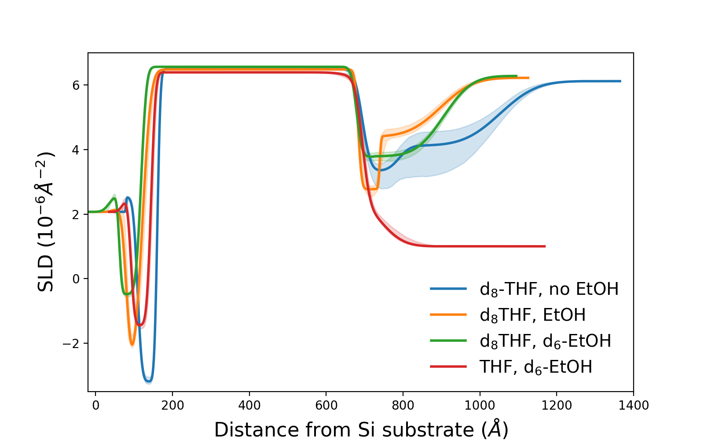

# Analysis summary [2023 experiments]

QUESTION: in which figure do we use January Cu-F?

## Figure 1: Structure as a function of current density
July Cu-A. Fit output files can be found in `july2023/data/results/refl1d_output`.

| Current | Run |
| --- | --- |
| OCV 1 | 206907 |
| -0.5 | 206915 |
| -0.5 | 206931 |
| -1 | 206946 |
| -2 | 206961 |
| -3 | 206976 |
| 1 hour | 206998 |

The last two measurements, at the highest current and following an hour, don't show evidence of
a distinct inner layer. In the plot above, we model those two runs without an inner layer.
The inner layer is likely still present, but the SEI layer has a slightly lower SLD that for
previous measurement, such that there is no contrast with the inner layer.
To justify our approach, we compared both measurements modeled with and without an innder layer.
The results agree within the 90% confidence intervals and there is therefore no value is modeling this data with an inner layer.

## Figure 2: Time-resolved

- dTHF, no EtOH is Jan Cu-B
- dTHF, EtOH is Cu-K
- dTHF, dEtOH is Cu-F

## Figure 3: Deuteration comparison
The plots are missing Cu-G with THF and dEtOH.
### Cycle 1

### Cycle 2

### Cycle 3

### R(q) and fit parameters
- dTHF, no EtOH is Jan Cu-B
    
    
    - [Parameters for OCV 1](jan2023/data/results/REFL_201282.md)
    - [Parameters for OCV 2](jan2023/data/results/REFL_201290.md)
    - [Parameters for OCV 3](jan2023/data/results/REFL_201298.md)
    - [Parameters for OCV 4](jan2023/data/results/REFL_201334.md)

- dTHF, EtOH is Cu-K
    
    
    - [Parameters for OCV 1](july2023/data/results/REFL_207268.md)
    - [Parameters for OCV 2](july2023/data/results/REFL_207282.md)
    - [Parameters for OCV 3](july2023/data/results/REFL_207296.md)
    - [Parameters for OCV 4](july2023/data/results/REFL_207304.md)

- dTHF, dEtOH is Cu-F
   
    
    - [Parameters for OCV 1](july2023/data/results/REFL_207161.md)
    - [Parameters for OCV 2](july2023/data/results/REFL_207169.md)
    - [Parameters for OCV 3](july2023/data/results/REFL_207177.md)
    - [Parameters for OCV 4](july2023/data/results/REFL_207187.md)
- THF, dEtOH is Cu-G
    - Results unchanged from previous version of the paper.

 

Table 1: Samples used for Figures 2 and 3
| |[January Cu-B dTHF no EtOH](jan2023/notebooks/Cu-B.ipynb) | [Cu-K dTHF + EtOH](july2023/notebooks/Cu-K.ipynb)| [Cu-F dTHF + dEtOH](july2023/notebooks/Cu-F.ipynb)|Cu-G THF + dEtOH|
|---| ---|---|---|---|
|Air | - |206864|206822|206829|
|OCV 1| 201282 |207268|207161|207194|
|CP 1| 201289| 207275|207168|207201|
|OCV 2| 201290 |207282|207169|207202
|CP 2| 201297 | 207289|207176|207209
|OCV 3|201298|207296|207177|207210
|OCV 4|*201334* NOTE|207304|207187|207218|

NOTE: Is this the correct run?

